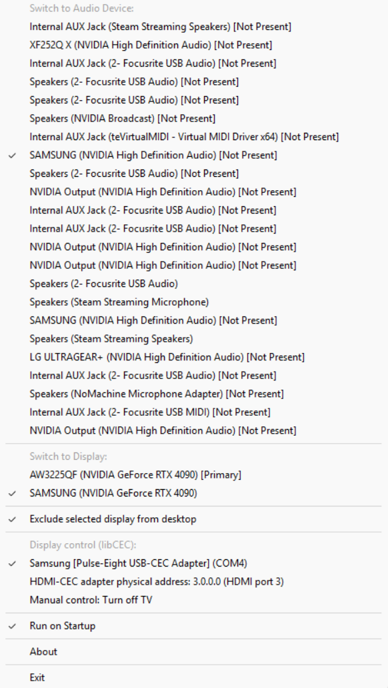

# Big Picture Switch

Ever want to use your main desktop as a game console using Steam?  Look no further!
Big Picture Switch manages your audio and video devices to make the experience as seamless as possible.

Based off the excellent work of [Big Picture Audio Switch](https://github.com/cinterre/BigPictureAudioSwitch/).

# Usage

-   Clicking the system tray icon will allow you to configure your "Big Picture" devices.
-   Selecting an audio or video device will trigger them to be switched to when Big Picture Mode turns on
-   Clicking a selected item will deselect the device (if no device is selected, no action is taken)
    -   e.g., if you prefer to let Steam manage your displays, set your preferred display and then leave the display unchecked
-   If "Exclude selected display from desktop" is enabled, then the selected device will NOT appear in your desktop configuration
    -   i.e., if you have extended your desktop across multiple monitors, your selected device will be excluded from that list.
    -   This is ideal for a TV that you don't use unless you're playing games on it.
    -   A best effort is made to do this.
    If something weird happens, just close the program and hit Win+P to get back your original configuration.
-   If you have a device supported by [libcec](https://github.com/Pulse-Eight/libcec), you can use it to to power on and off your TV
    as well as switch inputs automatically when Big Picture Mode is turned on or off.
    - Support for this depends a lot on your TV.  My Samsung TV from 2008 seems to work fine for switching inputs and powering on, but
      it seems that the standby mode isn't implemented.
-   If your controller has a "guide button" (e.g., Xbox controller), you can use it to toggle Big Picture Mode and BPS will
    also listen for it to "re-do" the input switching in case you, e.g., fire up your Chromecast or something and want to go back.

# Planned features

-   Ability to set the window title/class for listening for Big Picture Mode (e.g. to use with Kodi or something like that)
-   Ability to select from multiple libcec-compatible devices or adapters (currently the first one found is used)
    -  Ideally, talking to a libcec-compatible device remotely (like a Raspberry Pi) to integrate with your existing home
       automation setup would be great too.
 
# Non planned features (WONTFIX)
- Support for other OSes, such as Linux or macOS
    -   I would also have to rewrite everything in some kind of portable GUI framework which sounds like a lot of bloat
      - Or special case it which would be even worse
    -   I would need to test and vet any third party libraries to do the audio device/display device switching or write this myself

# Differences compared to BPAS

-   This is native code in C++, not C#, which is a bit easier to work with because audio switching in Windows needs to be done through COM anyway
    -   And there is no native C# library to do this other than AudioSwitcher, which depends on .NET Framework, etc...
-   One executable that does it all
  -  libcec is statically linked in
  -  Windows dependencies are not (C, C++ runtime, etc)
-   Event based rather than polling based (where possible)
    -   Receives events for window creation and destruction and then just matches that against Steam to detect Big Picture mode
    -   libcec polls, can't do much about that.
        - However, if you don't have a libcec-compatible device, then libcec is not used at all and BPS is truly event-based
-   Efficiency mode support
    -   only libcec polls for things, and this mitigates (should completely eliminate) the effect that would have on your games
-   Manages display configurations _and_ audio configurations, as well as the TV power state and input switching

# Installation

Place somewhere you won't delete it, and run it.  You can mark it to start with Windows.  I have only tested it on Windows 11 (which I recommend you use anyway).

# Motivation

The original [Big Picture Audio Switch](https://github.com/cinterre/BigPictureAudioSwitch/) project that I was using worked
fine if you were willing to extend your desktop onto your TV and then set your preferred display in Steam to it.
However, I found this kind of annoying -- when my TV is off, Windows still sees it as a display and I can "move" my cursor
onto it.  On a technical level, sure, it's a display connected to my system, but on a practical level, I don't use it like
I use my main displays on my deskop.  Also, my windows would get kind of screwed up too -- I'd randomly have windows
open on the TV, and if it was off, it wouldn't be obvious except when I went to go looking for them.  So I wanted a solution
that would manage both the audio _and_ display devices on the system.

Originally I was going to fork BPAS to do this, when I noticed "high CPU usage" when running it.  There's something going on with the C# AudioSwitcher library used by that.
After trying to debug it a bit, I realized it would be easier to just use the COM and Win32 interfaces directly in C++ and use event-based monitoring.
C++ was the most straightforward choice to do this with minimal overhead and bloat.

So... that's how I got to developing Big Picture Switch.

# Some notes/troubleshooting tips
-   The SetDisplayConfig calls need to use `SDC_SAVE_TO_DATABASE` because otherwise, some games will attempt to set the display
    configuration themselves, and use the database to do it.  So, if it wasn't saved, then the game could potentially end up
    on the wrong monitor.
-   The original display configuration is restored when Big Picture Mode is exited (and saved to the database).
-   Display configuration switches happen with up to 5 attempts with a 1 second delay between each.  This seems to work well enough so far.
  -  Sometimes SetDisplayConfig can fail with `ERROR_GEN_FAILURE` -- not much I can do about that.  Hardware can be finicky.
-   If the application exited improperly, it seems Windows is pretty robust at fixing up your displays, just hit Win+P to get back to your original configuration.
  -  Hopefully this doesn't happen too often.
-  If the Efficiency Mode mitgation isn't enough, file an issue and we can discuss.
      - Could mitigate further if needed, but to really solve this, libcec needs to be ported to use async I/O and not spin up threads
      - Fixing libcec is out of scope at this time